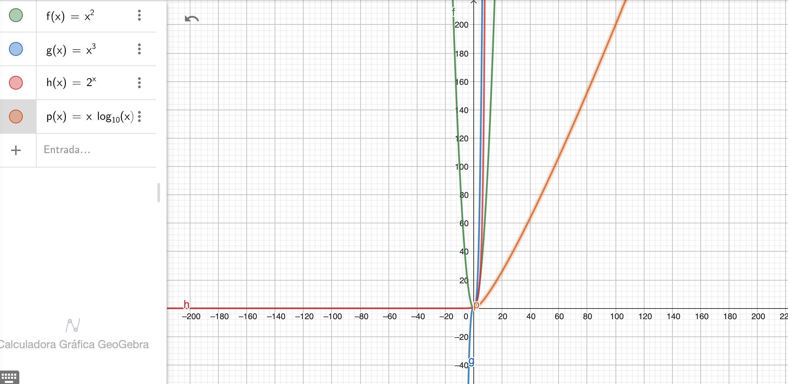

Desafío Teórico

Procesos, Hilos y Corrutinas.

1.	Un caso en el que usarías procesos para resolver un problema y por qué.

Los procesos hacen referencia a instancias que son independientes, están de cierta manera aislados, aunque puedan comunicarse entre ellos.

•	Un problema que podría abordarse con este enfoque de procesos puede ser el procesamiento de lotes de datos, cuando se usan grandes conjuntos de datos, dividir la funcionalidad principal en diferentes procesos para paralelizar la ejecución.

2.	Un caso en el que usarías threads para resolver un problema y por qué.

Los threads son unidades más pequeñas de ejecución de un proceso, Comparten recursos y facilita la comunicación entre ellos, pero requiere más atención a la sincronización 

•	Un chat en tiempo real: cada conversación en un sistema de chats puede ser un hilo en sí, de esa manera se pueden manejar más solicitudes concurrentes, cada Thread atendería cada solicitud del chat así más usuarios pueden interactuar con la aplicación al tiempo

3.	Un caso en el que usarías corrutinas para resolver un problema y por qué.

Son rutinas cooperativas, sirven para la ejecución asincrónica y concurrente de tareas.

•	Un ejemplo podría ser una comunicación concurrente en la red, se puede manejar la conexión a la red en Corrutinas que permita que se realicen diversas operaciones mientras otras Corrutinas esperan respuesta de comunicación, asi mejora la eficiencia.

Optimización de recursos del sistema operativo

Si tuvieras 1.000.000 de elementos y tuvieras que consultar para cada uno de
ellos información en una API HTTP. ¿Cómo lo harías? Explicar.

•	Habría que optimizar los recursos tanto como sea posible, relacionado al punto anterior se pueden paralelizar solicitudes cuando sea posible hacer diferentes solicitudes de forma paralela.
•	Se puede usar el almacenamiento temporal en memoria para guardar información que pueda necesitar posteriormente y no tener que volver a preguntar al API.
•	Optimizar los lotes, se pueden agrupar en lotes para reducir sobrecarga de la red y hacer grupos de solicitudes al API.
•	Conocer el Rate Limit del API para poder tener en cuenta los límites de solicitudes que se puedan realizar al API para así dividir el gran conjunto de consultas entre consultas que son aceptadas por las restricciones del API

Análisis de complejidad

1.	Dados 4 algoritmos A, B, C y D que cumplen la misma funcionalidad, con complejidades O(n^2), O(n^3), O(2^n) y O(n log n), respectivamente, ¿Cuál de los algoritmos favorecerías y cuál descartarías en principio? Explicar por qué.

 

Según el análisis de la complejidad de algoritmos, O(n log n), es el que presenta el crecimiento menos acelerado, por lo tanto entre las opciones presentes el de menor complejidad, por lo que sería el que favorezca.

Por otra parte, el algoritmo O(2^n) sería un crecimiento exponencial que es mayor a los demás, por lo cual sería la complejidad más crítica y debería ser la primera en ser descartada.

2.	Asume que dispones de dos bases de datos para utilizar en diferentes problemas a resolver. La primera llamada AlfaDB tiene una complejidad de O(1) en consulta y O(n^2) en escritura. La segunda llamada BetaDB que tiene una complejidad de O(log n) tanto para consulta, como para escritura. ¿Describe en forma sucinta, qué casos de uso podrías atacar con cada una?

En este caso AlfaDB O(1) en consulta y O(n^2) en escritura

Sería la más adecuada cuando se realizan muchas consultas, pero pocas escrituras por la baja complejidad de la consulta pero utilizar lo menos posible la alta complejidad de la escritura.

BetaDB  O(log n) tanto para consulta, como para escritura

Sería la más eficiente cuando se manejan altos volúmenes de escritura y consulta, ya que la relación de complejidad es mejor que en caso anterior para la escritura entonces la complejidad del algoritmo es más escalable cuando los datos van creciendo dinámicamente en el tiempo tanto en consulta como en escritura.
